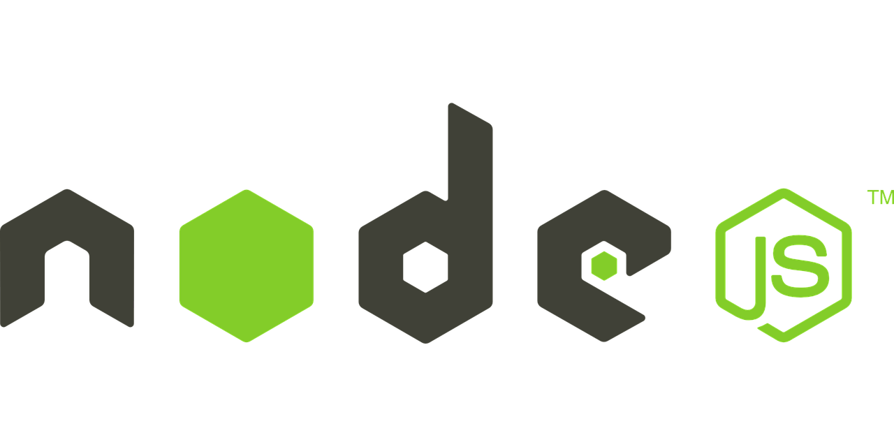

# Servidores com NodeJS

Os códigos deste repositório é referente aos vídeos que encontrei no YouTube no canal [CollabCode](https://www.youtube.com/channel/UCVheRLgrk7bOAByaQ0IVolg).

Como criar um servidor com NodeJS. Disponível em: [https://www.youtube.com/playlist?list=PLirko8T4cEmy3m-KziWgI-kSo6qUd1e-N](https://www.youtube.com/playlist?list=PLirko8T4cEmy3m-KziWgI-kSo6qUd1e-N).
